# 🏋️‍♂️ HealthFit

> **AI 기반 개인 맞춤 식단·운동 추천 건강관리 플랫폼**

<br />

<p align="center">
  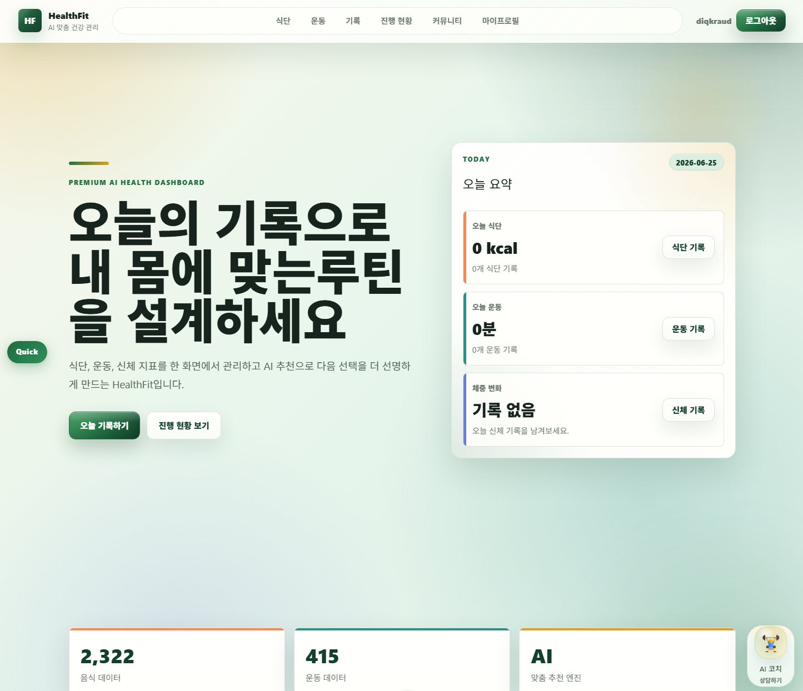
</p>

<br />

## 📌 프로젝트 소개

**HealthFit**은 사용자의 신체 정보, 운동 목표, 활동량, 식단 기록, 운동 기록을 기반으로 개인에게 적합한 식단과 운동 루틴을 추천하는 **AI 기반 건강 관리 플랫폼**입니다.

사용자는 마이프로필에 자신의 신체 정보와 목표를 입력하고, 서비스는 이를 바탕으로 하루 권장 칼로리와 탄수화물·단백질·지방 권장 비율을 계산합니다. 이후 음식 데이터와 운동 데이터를 활용하여 개인 맞춤형 식단과 운동 루틴을 추천합니다.

또한 사용자는 추천받은 식단과 운동 루틴을 저장하고, 커뮤니티를 통해 다른 사용자와 식단, 운동 루틴, 운동 기록을 공유할 수 있습니다.

<br />

---

## 📚 목차

* [A. 팀원 정보 및 업무 분담 내역](#a-팀원-정보-및-업무-분담-내역)
* [B. 목표 서비스 및 실제 구현 정도](#b-목표-서비스-및-실제-구현-정도)
* [C. 데이터베이스 모델링 ERD](#c-데이터베이스-모델링-erd)
* [D. 추천 알고리즘에 대한 기술적 설명](#d-추천-알고리즘에-대한-기술적-설명)
* [E. 핵심 기능에 대한 설명](#e-핵심-기능에-대한-설명)
* [F. 생성형 AI를 활용한 부분](#f-생성형-ai를-활용한-부분)
* [G. 서비스 URL](#g-서비스-url)
* [H. 기타 포함 내용](#h-기타-포함-내용)

<br />

---

# A. 팀원 정보 및 업무 분담 내역

| 이름  | 주요 역할        | 담당 업무                                                                                                                  |
| --- | ------------ | ---------------------------------------------------------------------------------------------------------------------- |
| 장대산 | Backend      | Django REST Framework 기반 API 구현, 데이터베이스 모델 설계, JWT 인증 처리, AI 식단 추천 및 저장 로직 구현, AI 운동 추천 로직 구현, 식단/운동/커뮤니티 관련 백엔드 기능 구현 |
| 서동위 | Frontend     | Vue 3 기반 화면 구현, 사용자 인터페이스 구성, Pinia 상태 관리, Axios API 연동, 식단/운동/커뮤니티 화면 구현, 반응형 UI 및 사용자 경험 개선                          |
| 공통  | 기획 / 설계 / 검수 | 서비스 기획, 요구사항 분석, ERD 설계, API 명세 정리, 화면 흐름 설계, 기능 테스트, 발표 및 README 작성                                                   |

<br />

---

# B. 목표 서비스 및 실제 구현 정도

## 🎯 목표 서비스

본 프로젝트의 목표는 단순한 음식 검색 또는 운동 목록 제공이 아니라, 사용자의 목표 달성을 돕는 **개인 맞춤형 건강 관리 서비스**를 구현하는 것입니다.

주요 목표는 다음과 같습니다.

1. 사용자의 신체 정보와 목표를 기반으로 하루 권장 칼로리와 영양 비율을 계산한다.
2. 음식 데이터베이스를 활용하여 목표 칼로리와 탄단지 비율에 맞는 식단을 추천한다.
3. 사용자의 운동 경험과 목표를 기반으로 적절한 운동 루틴을 추천한다.
4. 사용자가 기록한 하루 식단을 분석하여 점수와 피드백을 제공한다.
5. 사용자가 자신의 식단과 운동 루틴을 저장하고 커뮤니티에 공유할 수 있도록 한다.

<br />

<details>
<summary><strong>✅ 실제 구현 기능 보기</strong></summary>

<br />

| 구분    | 기능          | 구현 여부 | 설명                                   |
| ----- | ----------- | ----- | ------------------------------------ |
| 회원    | 회원가입        | ✅ 완료  | 아이디, 이메일, 비밀번호 기반 회원가입               |
| 회원    | 로그인         | ✅ 완료  | JWT 기반 로그인                           |
| 회원    | 로그아웃        | ✅ 완료  | 로그인 사용자 로그아웃 처리                      |
| 프로필   | 마이프로필 저장/수정 | ✅ 완료  | 성별, 나이, 키, 몸무게, 활동량, 운동 목표, 운동 경험 저장 |
| 식단    | 권장 칼로리 계산   | ✅ 완료  | 프로필 정보를 기반으로 하루 권장 칼로리와 탄단지 권장량 계산   |
| 식단    | 음식 검색       | ✅ 완료  | 음식명 기준 검색 및 영양 정보 조회                 |
| 식단    | 사용자 음식 추가   | ✅ 완료  | 사용자가 직접 음식명과 영양성분 등록                 |
| 식단    | 식단 기록       | ✅ 완료  | 아침, 점심, 저녁, 간식 단위로 날짜별 식단 기록         |
| 식단    | 저장 식단       | ✅ 완료  | 추천받은 식단 또는 직접 구성한 식단 저장              |
| AI    | AI 식단 추천    | ✅ 완료  | 프로필, 목표 칼로리, 탄단지 비율 기반 식단 추천         |
| AI    | 오늘의 식단 평가   | ✅ 완료  | 하루 식단을 분석하여 점수와 피드백 제공               |
| AI    | AI 운동 추천    | ✅ 완료  | 운동 목표, 운동 경험, 가능 시간 기반 루틴 추천         |
| AI    | AI 질문 응답    | ✅ 완료  | 식단, 운동, 영양 관련 질문에 대한 AI 답변           |
| 운동    | 운동 목록 조회    | ✅ 완료  | 운동 데이터 목록 조회                         |
| 운동    | 운동 상세 조회    | ✅ 완료  | 운동 부위, 장비, 자극 근육, 수행 방법, GIF 확인      |
| 운동    | 운동 루틴 생성    | ✅ 완료  | 추천받은 운동 또는 직접 선택한 운동으로 루틴 생성         |
| 운동    | 운동 기록 저장    | ✅ 완료  | 수행 운동, 시간, 세트 수, 반복 횟수, 메모 저장        |
| 진행 현황 | 진행 현황 조회    | ✅ 완료  | 체중, 섭취 칼로리, 식단 점수, 운동 횟수 확인          |
| 커뮤니티  | 게시글 작성/조회   | ✅ 완료  | 식단, 운동 루틴, 운동 기록 공유                  |
| 커뮤니티  | 댓글          | ✅ 완료  | 게시글에 댓글 작성, 수정, 삭제                   |
| 커뮤니티  | 좋아요         | ✅ 완료  | 게시글 좋아요 및 취소                         |
| 배포    | 서비스 배포      | 선택 구현 | 배포 또는 임시 시연 URL 작성                   |

</details>

<br />

---

# C. 데이터베이스 모델링 ERD

본 프로젝트는 사용자, 프로필, 식단, 운동, AI 추천, 진행 현황, 커뮤니티 기능을 중심으로 데이터베이스를 설계했습니다.

<br />

<p align="center">
  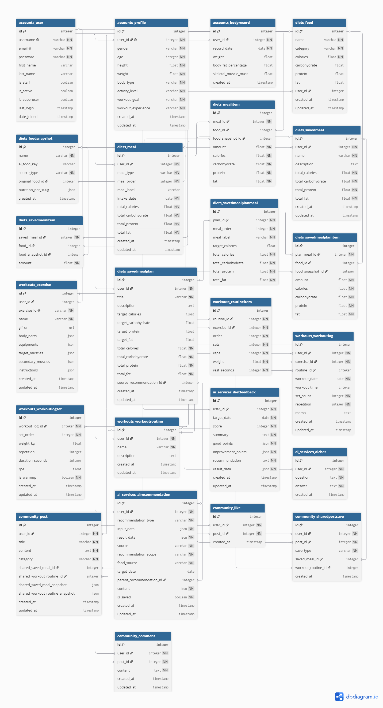
</p>

<br />

<details>
<summary><strong>📌 주요 테이블 설명 보기</strong></summary>

<br />

| 분류    | 주요 테이블                              | 설명                                       |
| ----- | ----------------------------------- | ---------------------------------------- |
| 회원    | `users`                             | 사용자 계정 정보 저장                             |
| 프로필   | `profiles`                          | 신체 정보, 활동량, 운동 목표, 운동 경험 저장              |
| 신체 기록 | `body_records`                      | 날짜별 체중, 체지방률, 골격근량, BMI 기록               |
| 음식    | `foods`                             | 음식명, 카테고리, 칼로리, 탄수화물, 단백질, 지방 정보 저장      |
| 식단 기록 | `meals`, `meal_items`               | 날짜별 식사 기록과 식사별 음식 항목 저장                  |
| 저장 식단 | `saved_meals`, `saved_meal_items`   | 추천받거나 직접 구성한 식단 저장                       |
| 식단 평가 | `diet_feedbacks`                    | AI가 분석한 식단 점수와 피드백 저장                    |
| 운동    | `workouts`                          | 운동명, GIF URL, 운동 부위, 장비, 자극 근육, 수행 방법 저장 |
| 운동 루틴 | `workout_routines`, `routine_items` | 사용자별 운동 루틴과 루틴 내 운동 항목 저장                |
| 운동 기록 | `workout_logs`                      | 실제 수행한 운동 기록 저장                          |
| AI    | `ai_recommendations`, `ai_chats`    | AI 추천 결과와 AI 질문 응답 기록 저장                 |
| 진행 현황 | `progress_records`                  | 날짜별 체중, 섭취 칼로리, 식단 점수, 운동 횟수 저장          |
| 커뮤니티  | `posts`, `comments`, `likes`        | 게시글, 댓글, 좋아요 정보 저장                       |

</details>

<br />

<details>
<summary><strong>🔗 주요 관계 보기</strong></summary>

<br />

* 사용자 1명은 프로필 1개를 가집니다.
* 사용자 1명은 여러 개의 식단 기록을 가질 수 있습니다.
* 사용자 1명은 여러 개의 저장 식단을 가질 수 있습니다.
* 사용자 1명은 여러 개의 운동 루틴과 운동 기록을 가질 수 있습니다.
* 식단 기록 1개는 여러 음식 항목을 가질 수 있습니다.
* 저장 식단 1개는 여러 음식 항목을 가질 수 있습니다.
* 운동 루틴 1개는 여러 운동 항목을 가질 수 있습니다.
* 게시글 1개는 여러 댓글과 좋아요를 가질 수 있습니다.
* AI 추천 결과는 사용자와 연결되며, 추천 유형에 따라 식단 추천 또는 운동 추천으로 구분됩니다.

</details>

<br />

---

# D. 추천 알고리즘에 대한 기술적 설명

## 1. AI 식단 추천 알고리즘

<details>
<summary><strong>🍱 AI 식단 추천 알고리즘 상세 보기</strong></summary>

<br />

AI 식단 추천은 사용자의 마이프로필 정보와 권장 칼로리 계산 결과를 기반으로 동작합니다.

### 입력 데이터

* 성별
* 나이
* 키
* 몸무게
* 활동량
* 운동 목표
* 하루 권장 칼로리
* 권장 탄수화물/단백질/지방 비율
* 음식 데이터베이스의 음식별 영양 정보
* 사용자의 선호 조건
* 제외하고 싶은 음식 정보

### 처리 과정

```txt
사용자 프로필 조회
        ↓
하루 권장 칼로리 계산
        ↓
탄수화물 / 단백질 / 지방 권장량 계산
        ↓
음식 데이터베이스에서 추천 후보 조회
        ↓
사용자 목표와 선호 조건을 AI 프롬프트에 반영
        ↓
AI가 아침 / 점심 / 저녁 / 간식 단위로 식단 구성
        ↓
추천 결과를 JSON 구조로 저장
        ↓
사용자가 추천 식단 저장 가능
```

### 결과 데이터

* 추천 식단 제목
* 총 칼로리
* 총 탄수화물
* 총 단백질
* 총 지방
* 아침/점심/저녁/간식별 음식 목록
* 음식별 섭취량
* 추천 이유

</details>

<br />

## 2. AI 운동 추천 알고리즘

<details>
<summary><strong>🏃 AI 운동 추천 알고리즘 상세 보기</strong></summary>

<br />

AI 운동 추천은 사용자의 운동 목표, 운동 경험, 체형, 운동 가능 시간 등을 기반으로 동작합니다.

### 입력 데이터

* 사용자 체형
* 운동 목표
* 운동 경험
* 운동 가능 시간
* 주간 운동 빈도
* 운동 선호 조건
* 운동 데이터베이스의 운동 정보

### 처리 과정

```txt
사용자 프로필 조회
        ↓
운동 목표 / 운동 경험 / 가능 시간 확인
        ↓
운동 데이터베이스에서 운동 후보 조회
        ↓
사용자의 경험 수준에 맞는 루틴 조건 구성
        ↓
AI가 운동 순서 / 세트 수 / 반복 횟수 / 시간을 포함한 루틴 추천
        ↓
추천 루틴 저장 가능
```

### 결과 데이터

* 추천 루틴 제목
* 운동 목표
* 추천 이유
* 운동 목록
* 운동별 세트 수
* 운동별 반복 횟수
* 운동 시간
* 운동 순서

</details>

<br />

## 3. 오늘의 식단 평가 알고리즘

<details>
<summary><strong>📊 오늘의 식단 평가 알고리즘 상세 보기</strong></summary>

<br />

오늘의 식단 평가는 사용자가 기록한 하루 식단을 분석하여 점수와 피드백을 제공하는 기능입니다.

### 입력 데이터

* 사용자의 하루 식단 기록
* 식사별 음식 목록
* 음식별 섭취량
* 총 섭취 칼로리
* 총 탄수화물
* 총 단백질
* 총 지방
* 사용자의 권장 칼로리
* 권장 탄단지 비율

### 처리 과정

```txt
선택한 날짜의 식단 기록 조회
        ↓
식단 기록에 포함된 음식들의 영양성분 합산
        ↓
권장 칼로리와 실제 섭취 칼로리 비교
        ↓
권장 탄단지 비율과 실제 섭취 비율 비교
        ↓
AI가 부족하거나 과다한 영양 요소 분석
        ↓
식단 점수와 피드백 저장
```

</details>

<br />

---

# E. 핵심 기능에 대한 설명

## 🖥️ 실행 화면 요약

> 실제 이미지 파일명은 프로젝트의 `docs/images/` 경로에 맞게 수정합니다.

<br />

<details open>
<summary><strong>1. 회원가입 / 로그인 / 로그아웃</strong></summary>

<br />

사용자는 아이디, 이메일, 비밀번호를 입력하여 회원가입할 수 있습니다.
로그인 후 JWT 토큰을 발급받아 인증이 필요한 기능을 사용할 수 있으며, 로그아웃을 통해 인증 상태를 종료할 수 있습니다.

<p align="center">
  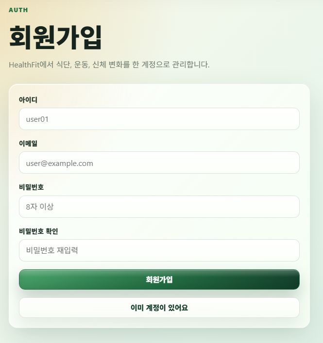
  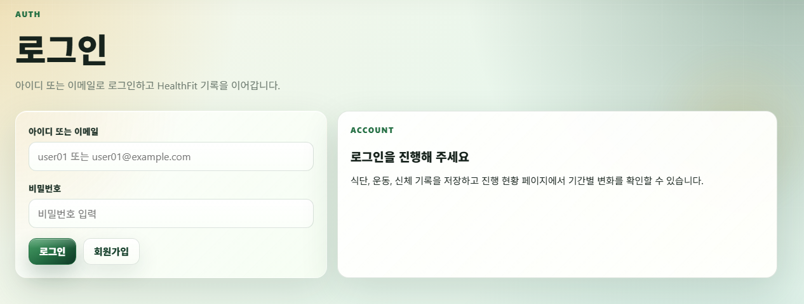
</p>

</details>

<br />

<details>
<summary><strong>2. 마이프로필</strong></summary>

<br />

마이프로필은 AI 추천 기능의 기준이 되는 핵심 데이터입니다.
사용자는 성별, 나이, 키, 몸무게, 체형, 활동량, 운동 목표, 운동 경험을 저장하고 수정할 수 있습니다.

저장된 프로필 정보는 권장 칼로리 계산, AI 식단 추천, 오늘의 식단 평가, AI 운동 추천, 진행 현황 분석에 활용됩니다.

<p align="center">
  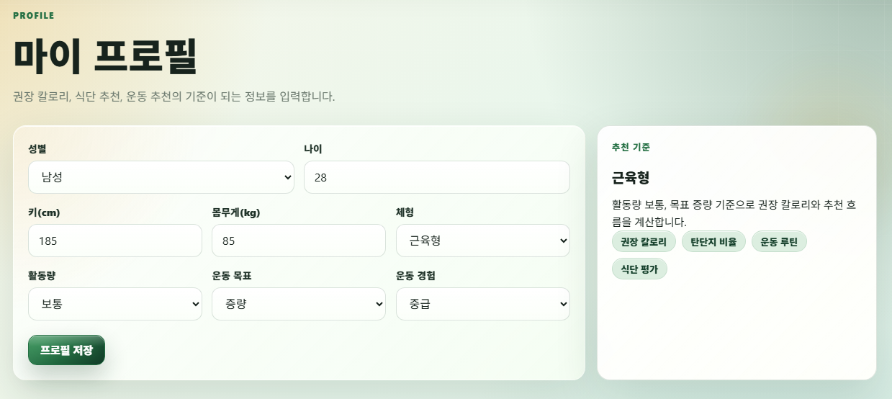
</p>

</details>

<br />

<details>
<summary><strong>3. 식단 대시보드</strong></summary>

<br />

식단 대시보드는 사용자의 식단 관련 핵심 정보를 한눈에 보여주는 화면입니다.

제공 정보는 다음과 같습니다.

* 하루 권장 칼로리
* 오늘 섭취 칼로리
* 탄수화물/단백질/지방 비율
* 최근 식단 평가 점수
* 식단 기록, AI 추천, 식단 평가 페이지 이동

<p align="center">
  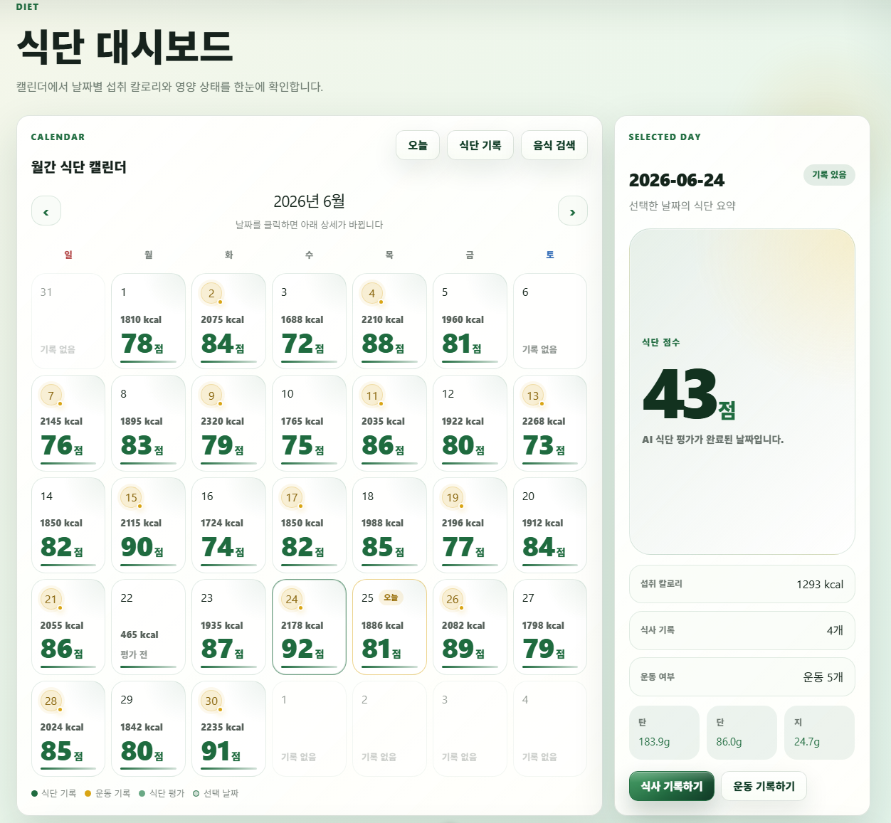
</p>

</details>

<br />

<details>
<summary><strong>4. 음식 검색 및 사용자 음식 추가</strong></summary>

<br />

사용자는 저장된 음식 데이터를 검색하여 음식별 영양 정보를 확인할 수 있습니다.
또한 직접 음식 이름, 칼로리, 탄수화물, 단백질, 지방 정보를 입력하여 자신만의 음식 데이터를 추가할 수 있습니다.

<p align="center">
  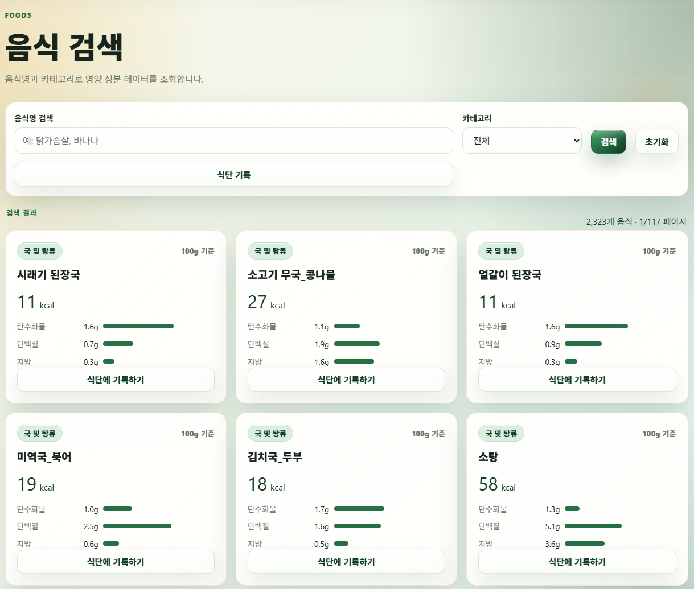
  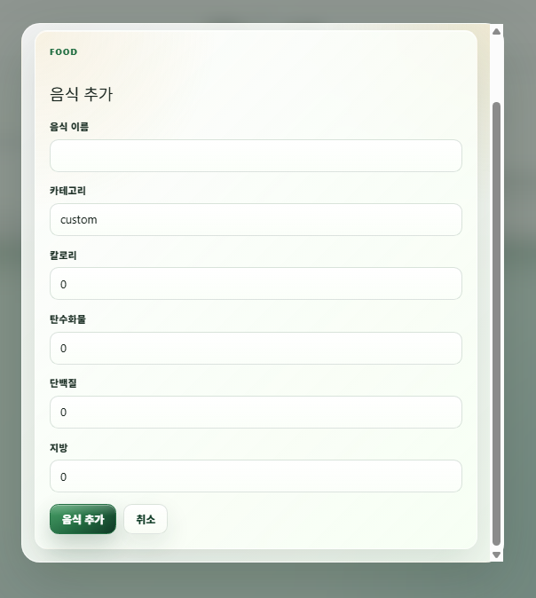
</p>

</details>

<br />

<details>
<summary><strong>5. 식단 기록</strong></summary>

<br />

사용자는 날짜별로 아침, 점심, 저녁, 간식 단위의 식단을 기록할 수 있습니다.

식단 기록에는 식사 날짜, 식사 유형, 음식 목록, 음식별 섭취량, 총 칼로리, 총 탄수화물, 총 단백질, 총 지방이 저장됩니다.

<p align="center">
  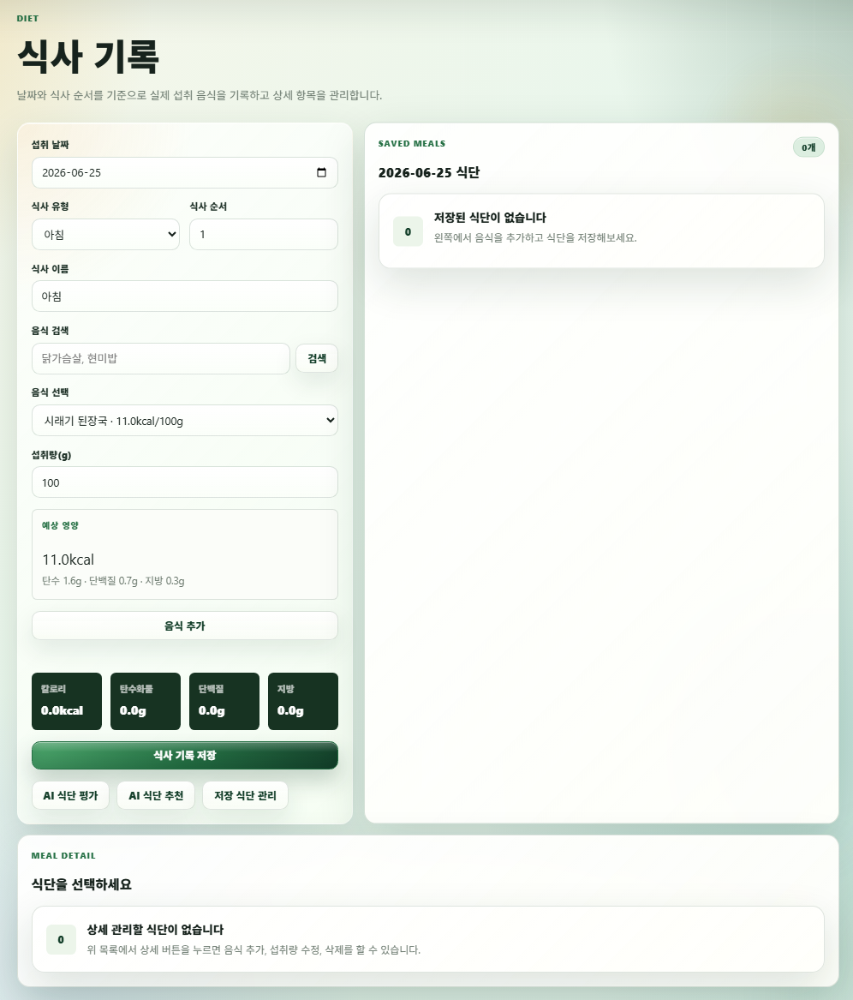
</p>

</details>

<br />

<details>
<summary><strong>6. AI 식단 추천</strong></summary>

<br />

AI 식단 추천은 사용자의 마이프로필 정보와 권장 칼로리 계산 결과를 기반으로 하루 식단을 추천하는 기능입니다.

추천 결과는 아침, 점심, 저녁, 간식 단위로 제공되며, 각 음식의 섭취량과 영양 정보를 포함합니다. 사용자는 추천받은 식단을 저장 식단으로 저장할 수 있습니다.

<p align="center">
  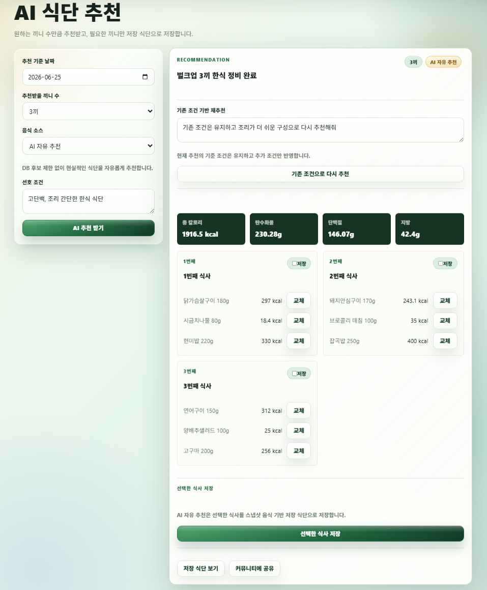
</p>

</details>

<br />

<details>
<summary><strong>7. 오늘의 식단 평가</strong></summary>

<br />

오늘의 식단 평가는 사용자가 기록한 하루 식단을 AI가 분석하여 점수와 피드백을 제공하는 기능입니다.

제공 정보는 다음과 같습니다.

* 식단 점수
* 총 섭취 칼로리
* 총 탄수화물
* 총 단백질
* 총 지방
* 부족하거나 과다한 영양소에 대한 피드백

<p align="center">
  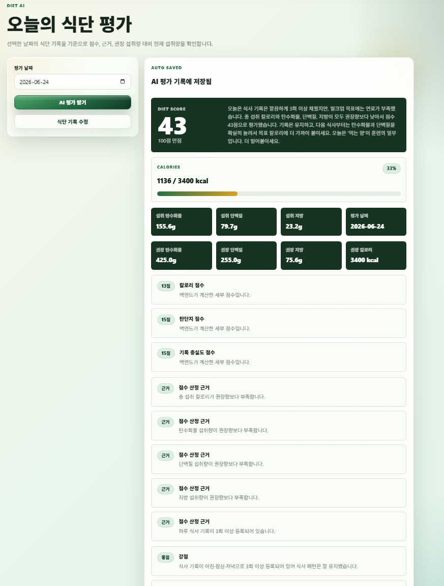
</p>

</details>

<br />

<details>
<summary><strong>8. 운동 목록 및 운동 상세</strong></summary>

<br />

사용자는 서비스에 등록된 운동 데이터를 조회하고, 운동별 상세 정보를 확인할 수 있습니다.

운동 상세 정보는 운동명, 운동 동작 GIF, 운동 부위, 필요한 장비, 주요 자극 근육, 보조 자극 근육, 운동 수행 방법을 포함합니다.

<p align="center">
  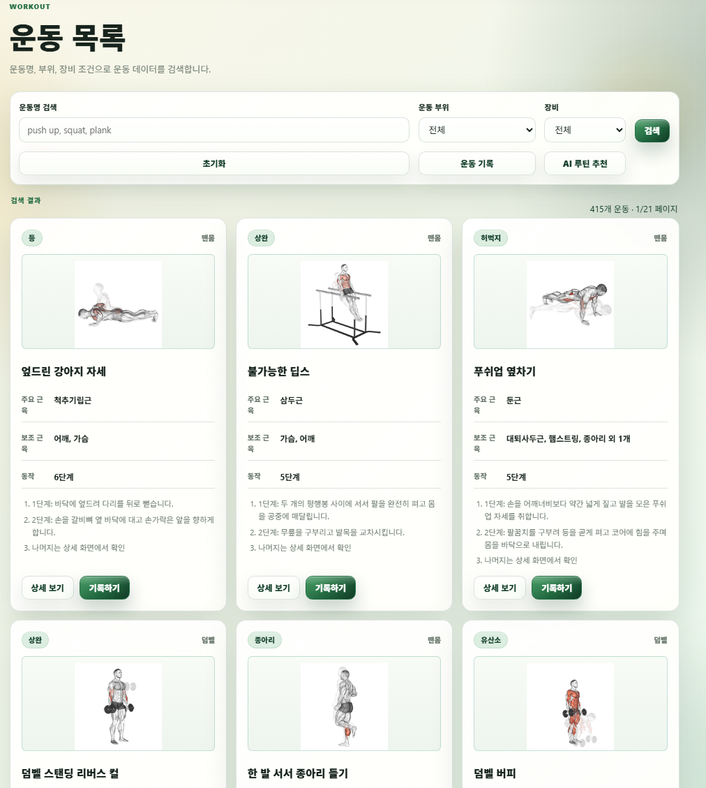
  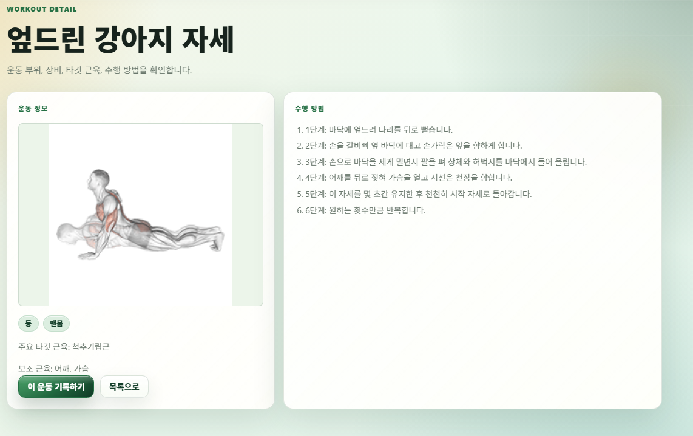
</p>

</details>

<br />

<details>
<summary><strong>9. AI 운동 추천 및 운동 루틴 관리</strong></summary>

<br />

AI 운동 추천은 사용자의 운동 목표, 운동 경험, 운동 가능 시간, 주간 운동 빈도를 기반으로 운동 루틴을 추천하는 기능입니다.

추천 결과는 운동 순서, 세트 수, 반복 횟수, 운동 시간, 추천 이유를 포함합니다.
사용자는 추천받은 루틴을 저장하거나 수정하여 자신만의 루틴으로 관리할 수 있습니다.

<p align="center">
  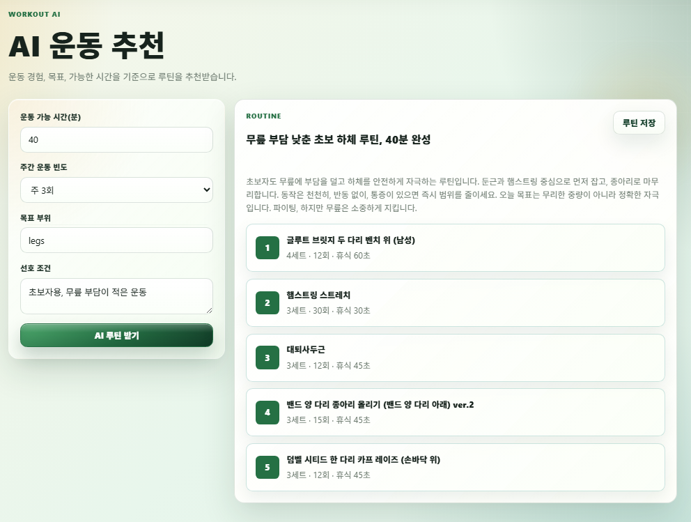
  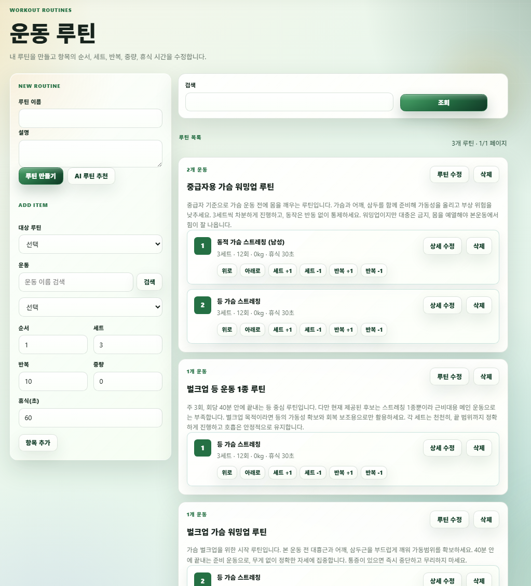
</p>

</details>

<br />

<details>
<summary><strong>10. 운동 기록 및 진행 현황</strong></summary>

<br />

사용자는 실제 수행한 운동 기록을 저장할 수 있습니다.
진행 현황 페이지에서는 사용자의 식단 기록, 운동 기록, 신체 기록을 기반으로 기간별 변화를 확인할 수 있습니다.

<p align="center">
  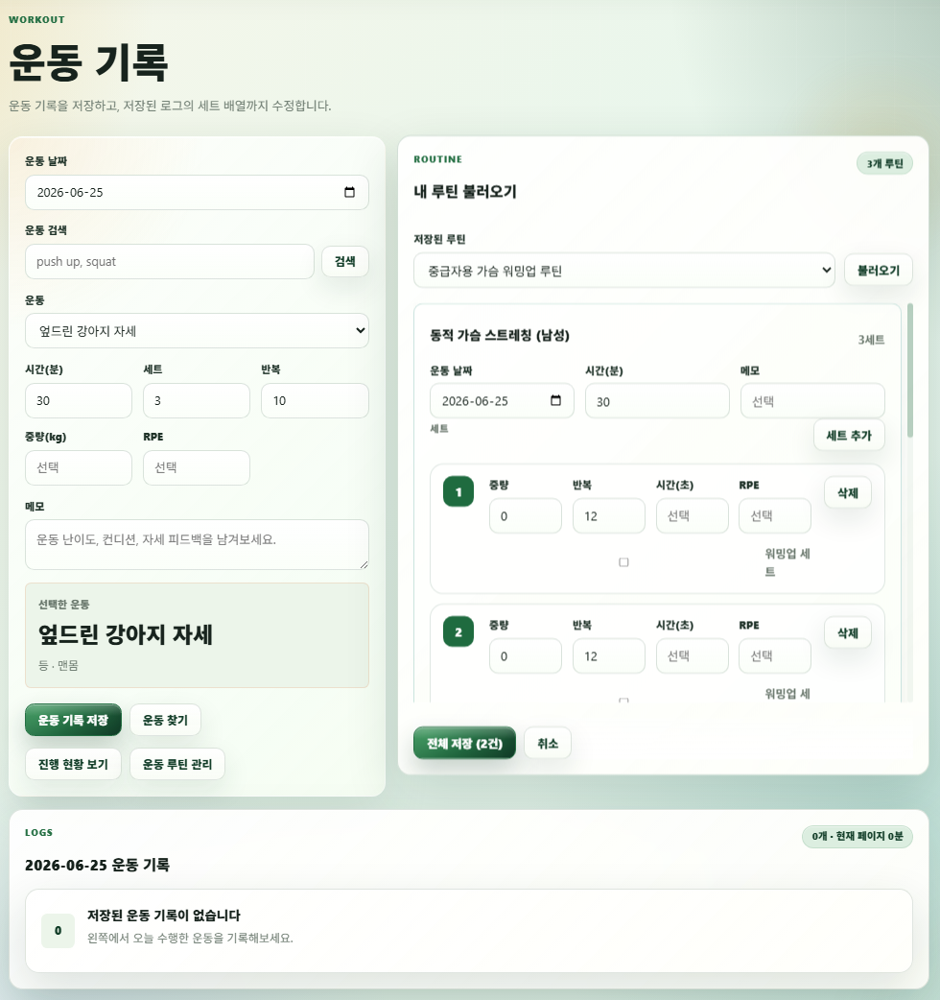
  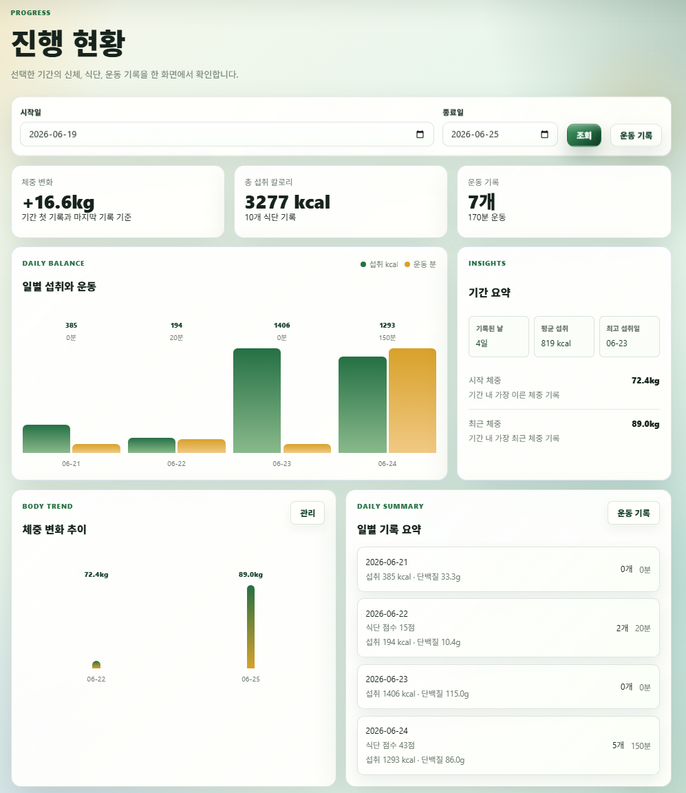
</p>

</details>

<br />

<details>
<summary><strong>11. AI 질문 응답</strong></summary>

<br />

사용자는 식단, 운동, 영양 정보에 대해 자유롭게 질문하고 AI 답변을 받을 수 있습니다.
AI 질문 응답 기록은 저장되어 사용자가 이전 질문과 답변을 다시 확인할 수 있습니다.

<p align="center">
  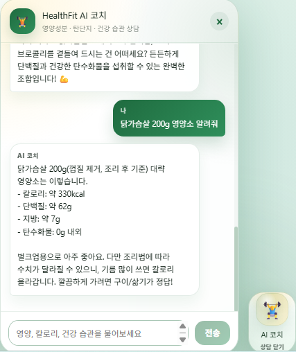
</p>

</details>

<br />

<details>
<summary><strong>12. 커뮤니티</strong></summary>

<br />

커뮤니티 기능을 통해 사용자는 자신의 식단, 운동 루틴, 운동 기록을 게시글 형태로 공유할 수 있습니다.

커뮤니티 기능은 다음을 포함합니다.

* 게시글 작성
* 게시글 목록 조회
* 게시글 상세 조회
* 게시글 검색 및 필터
* 댓글 작성, 수정, 삭제
* 좋아요 및 좋아요 취소

<p align="center">
  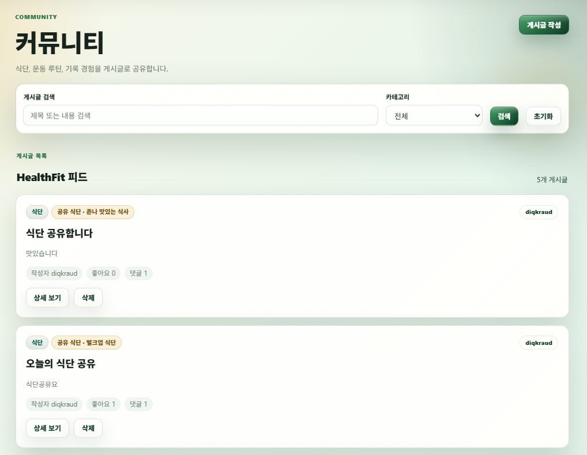
  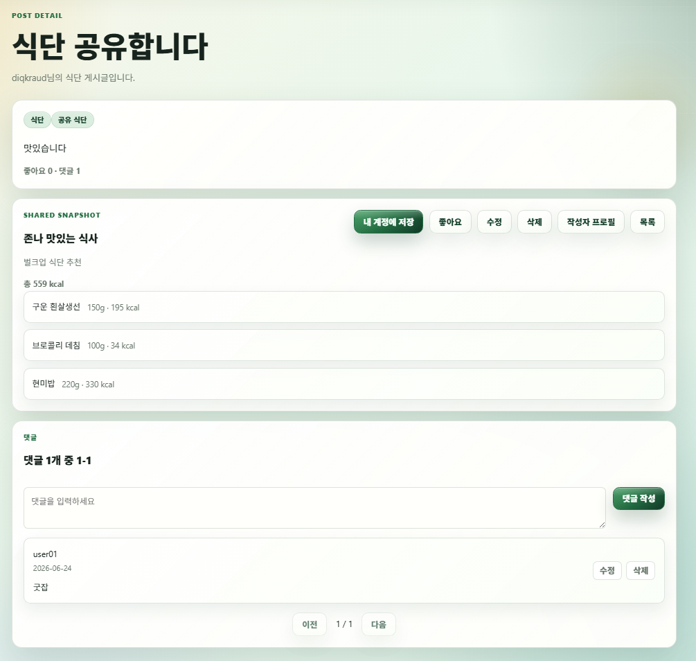
</p>

</details>

<br />

---

# F. 생성형 AI를 활용한 부분

본 프로젝트에서 생성형 AI는 사용자의 식단과 운동 데이터를 분석하고, 개인 맞춤형 추천과 피드백을 제공하는 기능에 활용되었습니다.

단순히 질문에 답변하는 챗봇이 아니라, 사용자의 프로필 정보, 식단 기록, 운동 목표, 운동 경험 등을 바탕으로 실제 서비스 기능과 연결되는 추천 결과를 생성하도록 구성했습니다.

<br />

<details open>
<summary><strong>1. AI 식단 추천</strong></summary>

<br />

AI 식단 추천 기능은 사용자의 마이프로필 정보와 권장 칼로리 계산 결과를 기반으로 하루 식단을 추천하는 기능입니다.

사용자의 성별, 나이, 키, 몸무게, 활동량, 운동 목표를 바탕으로 하루 권장 칼로리와 탄수화물·단백질·지방 권장 비율을 계산하고, 음식 데이터베이스의 영양 정보를 함께 활용하여 아침, 점심, 저녁, 간식 단위의 식단을 추천합니다.

추천 결과에는 다음 정보가 포함됩니다.

* 추천 식단 제목
* 아침 / 점심 / 저녁 / 간식별 음식 구성
* 음식별 섭취량
* 총 칼로리
* 총 탄수화물
* 총 단백질
* 총 지방
* 추천 이유

사용자는 AI가 추천한 식단을 저장 식단으로 저장할 수 있으며, 저장된 식단은 다시 조회하거나 커뮤니티에 공유할 수 있습니다.

</details>

<br />

<details>
<summary><strong>2. 오늘의 식단 평가</strong></summary>

<br />

오늘의 식단 평가 기능은 사용자가 기록한 하루 식단을 AI가 분석하여 점수와 피드백을 제공하는 기능입니다.

사용자가 아침, 점심, 저녁, 간식으로 기록한 음식 데이터를 기반으로 총 섭취 칼로리와 탄수화물·단백질·지방 섭취량을 계산하고, 사용자의 권장 섭취량과 비교합니다.

AI는 이 비교 결과를 바탕으로 다음과 같은 피드백을 제공합니다.

* 하루 식단 점수
* 총 섭취 칼로리 평가
* 탄수화물 섭취량 평가
* 단백질 섭취량 평가
* 지방 섭취량 평가
* 부족하거나 과다한 영양소에 대한 설명
* 다음 식사에서 보완하면 좋은 방향

이를 통해 사용자는 단순히 숫자로 된 영양 정보를 확인하는 것에서 그치지 않고, 자신의 식단이 목표에 맞는지 이해할 수 있습니다.

</details>

<br />

<details>
<summary><strong>3. AI 운동 추천</strong></summary>

<br />

AI 운동 추천 기능은 사용자의 운동 목표, 운동 경험, 체형, 운동 가능 시간 등을 기반으로 개인 맞춤형 운동 루틴을 추천하는 기능입니다.

사용자는 운동 가능 시간, 주간 운동 빈도, 원하는 운동 방향 등을 입력할 수 있으며, AI는 사용자의 운동 경험 수준을 고려하여 무리하지 않고 수행 가능한 루틴을 추천합니다.

추천 결과에는 다음 정보가 포함됩니다.

* 추천 루틴 제목
* 운동 목표
* 추천 이유
* 운동 목록
* 운동 순서
* 운동별 세트 수
* 운동별 반복 횟수
* 운동별 수행 시간

추천받은 운동 루틴은 저장할 수 있으며, 이후 운동 기록 작성과 진행 현황 확인에 활용할 수 있습니다.

</details>

<br />

<details>
<summary><strong>4. AI 질문 응답</strong></summary>

<br />

AI 질문 응답 기능은 사용자가 식단, 운동, 영양 정보와 관련된 질문을 입력하면 AI가 답변을 제공하는 기능입니다.

사용자는 서비스 이용 중 궁금한 점을 자유롭게 질문할 수 있으며, AI는 건강 관리 서비스의 범위에 맞게 식단, 운동, 영양, 생활 습관과 관련된 답변을 제공합니다.

또한 질문과 답변 기록은 저장되어 사용자가 이전에 받은 답변을 다시 확인할 수 있도록 구성했습니다.

</details>

<br />

<details>
<summary><strong>5. AI 활용 흐름 요약</strong></summary>

<br />

```txt
사용자 프로필 입력
        ↓
권장 칼로리 및 탄단지 비율 계산
        ↓
음식 데이터 / 운동 데이터 조회
        ↓
AI 추천 또는 평가 요청
        ↓
AI 결과 생성
        ↓
추천 결과 저장 또는 피드백 기록
        ↓
사용자 조회 및 커뮤니티 공유
```

생성형 AI는 HealthFit에서 사용자의 목표와 기록을 바탕으로 식단과 운동 방향을 제안하는 핵심 기능으로 활용되었습니다.

</details>

<br />

---

# G. 서비스 URL

<details open>
<summary><strong>🌐 서비스 URL</strong></summary>

<br />

## Cloudflare Tunnel을 활용한 임시 배포

본 프로젝트는 시연 기간 동안 Cloudflare Tunnel을 활용하여 로컬 서버를 외부에서 접근 가능하도록 구성했습니다.
단, 서버 종료 시 접근이 불가능합니다.

| 구분          | URL                               |
| ----------- | --------------------------------- |
| Frontend    | `https://임시주소`                    |
| Backend API | `https://임시주소/api/v1`             |
| API 명세서     | [Notion API 명세서 링크](https://app.notion.com/p/HealthFit_API_-3888c89b80b680bc9c3ff9b05f6c68da?source=copy_link) |

<br />


</details>

<br />

---

# H. 기타 포함 내용

## 1. 기술 스택

## Backend

<p>
  
  
  
  
  
</p>

## Frontend

<p>
  
  
  
  
  
  
  
  
</p>

## AI / API

<p>
  
  
  
</p>

## Tools

<p>
  
  
  
  
  
</p>

<br />

---

## 2. 프로젝트 구조

<details>
<summary><strong>📁 프로젝트 폴더 구조 보기</strong></summary>

<br />

```txt
13-pjt/
├─ backend/
│  ├─ accounts/
│  ├─ profiles/
│  ├─ diets/
│  ├─ workouts/
│  ├─ community/
│  ├─ ai_services/
│  ├─ fixtures/
│  ├─ manage.py
│  └─ requirements.txt
│
├─ frontend/
│  ├─ src/
│  │  ├─ assets/
│  │  ├─ components/
│  │  ├─ views/
│  │  ├─ stores/
│  │  ├─ router/
│  │  └─ api/
│  ├─ package.json
│  └─ vite.config.js
│
└─ docs/
   ├─ images/
   ├─ ERD.png
   └─ README-assets/
```

</details>

<br />

---

## 3. API 명세

본 프로젝트는 프론트엔드와 백엔드를 분리하여 개발했으며, RESTful API 설계를 기준으로 데이터를 주고받도록 구성했습니다.

API 명세서는 Notion 문서로 별도 관리하였습니다.

| 항목       | 내용                                     |
| -------- | -------------------------------------- |
| Base URL | `/api/v1`                              |
| 인증 방식    | JWT                                    |
| 인증 헤더    | `Authorization: Bearer {access_token}` |
| API 명세서  | [Notion API 명세서 링크](여기에_노션_링크_삽입)      |

상세한 요청 방식, Request Body, Response Body, 인증 필요 여부는 Notion API 명세서에서 확인할 수 있습니다.

<br />

---

## 4. 데이터 수집 및 가공

<details>
<summary><strong>🍚 음식 데이터</strong></summary>

<br />

음식 데이터는 식단 추천, 식단 기록, 오늘의 식단 평가에 사용됩니다.

음식 데이터는 다음 필드를 기준으로 구성했습니다.

* 음식 이름
* 음식 카테고리
* 칼로리
* 탄수화물
* 단백질
* 지방
* 사용자 추가 여부

음식 영양성분은 100g 기준으로 저장하고, 사용자가 입력한 섭취량에 따라 실제 섭취 칼로리와 탄단지를 계산하도록 구성했습니다.

```txt
섭취 칼로리 = 음식 칼로리 * 섭취량 / 100
섭취 탄수화물 = 음식 탄수화물 * 섭취량 / 100
섭취 단백질 = 음식 단백질 * 섭취량 / 100
섭취 지방 = 음식 지방 * 섭취량 / 100
```

</details>

<br />

<details>
<summary><strong>🏋️ 운동 데이터</strong></summary>

<br />

운동 데이터는 AI 운동 추천, 운동 루틴 생성, 운동 기록에 사용됩니다.

외부 운동 API를 활용하여 운동 데이터를 수집한 뒤, 서비스에서 필요한 필드만 선별하여 정제했습니다.

운동 데이터는 다음 필드를 포함합니다.

* 운동명
* 운동 동작 GIF URL
* 운동 부위
* 필요한 장비
* 주요 자극 근육
* 보조 자극 근육
* 운동 수행 방법

수집한 데이터는 사용자가 이해하기 쉽도록 한글화 과정을 거쳤으며, Django fixture 형태로 저장하여 초기 데이터베이스에 적재할 수 있도록 구성했습니다.

</details>

<br />

---

## 5. Git 협업 방식

<details open>
<summary><strong>🌿 Branch 전략</strong></summary>

<br />

| 브랜치                | 용도           |
| ------------------ | ------------ |
| `master` 또는 `main` | 최종 개발 브랜치    |
| `deploy/demo`      | 배포 및 시연용 브랜치 |
| `feature/*`        | 기능 단위 개발 브랜치 |

프로젝트 진행 중 기능 개발은 기능 단위로 분리하여 진행하고, 최종적으로 메인 브랜치에 병합했습니다.
시연 또는 배포가 필요한 경우 `deploy/demo` 브랜치를 별도로 두어 안정적인 시연 환경을 유지했습니다.

</details>

<br />

<details>
<summary><strong>💬 Commit Convention</strong></summary>

<br />

| 태그           | 의미                |
| ------------ | ----------------- |
| ✨ Feature    | 새로운 기능 추가         |
| 🐛 Fix       | 버그 수정             |
| 🚑 Hotfix    | 긴급 버그 수정          |
| 🔨 Refactor  | 기능 변화 없는 코드 구조 개선 |
| 🎨 Style     | 코드 스타일 및 구조 개선    |
| 💄 UI        | UI 및 스타일 개선       |
| 🚜 Structure | 폴더 및 파일 구조 변경     |
| 📰 File      | 새 파일 생성           |
| 📚 Docs      | 문서 작성 및 수정        |
| 🔥 Remove    | 불필요한 코드 및 파일 삭제   |
| 🚧 WIP       | 작업 진행 중           |
| 🚀 Deploy    | 배포 및 환경설정         |
| 💡 Idea      | 아이디어 제안           |

### Commit Message 예시

```txt
✨ AI 식단 추천 API 구현
✨ 운동 루틴 저장 기능 추가
🐛 로그인 토큰 저장 오류 수정
💄 메인 페이지 디자인 수정
📚 README 프로젝트 구조 정리
🚀 배포 환경 설정
```

</details>

<br />

<details>
<summary><strong>📸 GitLab Commit 내역</strong></summary>

<br />

<p align="center">
  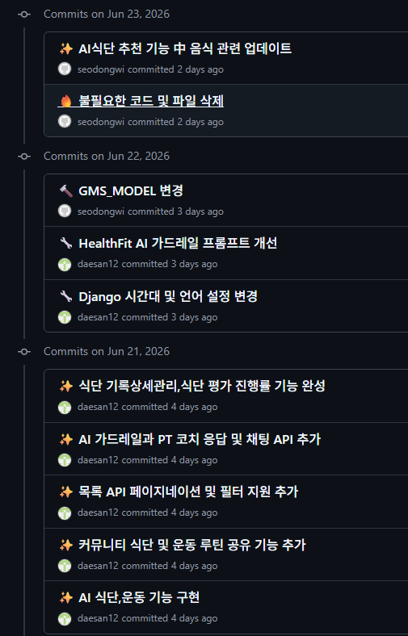
</p>

</details>

<br />

---

## 6. 실행 방법

<details>
<summary><strong>⚙️ Backend 실행</strong></summary>

<br />

```bash
cd backend

python -m venv venv

# Windows Git Bash
source venv/Scripts/activate

# Windows PowerShell
venv\Scripts\activate

pip install -r requirements.txt

python manage.py migrate

python manage.py loaddata fixtures/foods.json
python manage.py loaddata fixtures/workouts.json

python manage.py runserver
```

</details>

<br />

<details>
<summary><strong>💻 Frontend 실행</strong></summary>

<br />

```bash
cd frontend

npm install

npm run dev
```

</details>

<br />

<details>
<summary><strong>🔐 환경 변수 설정</strong></summary>

<br />

API Key와 Secret Key는 외부에 노출되지 않도록 `.env` 파일에서 관리합니다.
실제 `.env` 파일은 Git에 포함하지 않고, 필요한 환경 변수 예시는 `.env.example` 파일에 작성합니다.

### Backend `.env.example`

```env
SECRET_KEY=your-secret-key
DEBUG=True
GMS_KEY=your-gms-api-key
```

### Frontend `.env.example`

```env
VITE_API_BASE_URL=http://localhost:8000/api/v1
```

</details>

<br />

---

## 7. 트러블슈팅

<details open>
<summary><strong>🚨 AI 추천 결과 저장 구조 문제</strong></summary>

<br />

## 문제 상황

AI 식단 추천 결과는 화면에 정상적으로 출력되었지만, 사용자가 추천 식단을 저장하려고 할 때 저장 식단 목록에 정상적으로 반영되지 않는 문제가 발생했습니다.

처음에는 AI 추천 결과가 화면에 표시되었기 때문에 추천 기능 자체는 정상 동작한다고 판단했습니다.
하지만 저장 버튼을 눌렀을 때 실제 `saved_meals`, `saved_meal_items` 구조로 데이터가 저장되지 않거나, 저장된 식단 상세에서 음식 정보가 올바르게 연결되지 않는 문제가 있었습니다.

<br />

## 원인 분석

문제의 핵심 원인은 **AI 응답 구조와 실제 DB 저장 구조의 불일치**였습니다.

AI는 추천 결과를 생성할 때 사용자가 보기 좋은 형태의 식단 정보를 반환합니다.
하지만 저장 식단 기능은 단순한 텍스트가 아니라 다음과 같은 명확한 데이터 구조를 필요로 했습니다.

* 저장 식단 제목
* 저장 식단 설명
* 총 칼로리
* 총 탄수화물
* 총 단백질
* 총 지방
* 음식 ID
* 음식별 섭취량
* 저장 식단과 음식 항목 간의 관계

특히 DB에 존재하는 음식 기반 추천은 `food_id`를 통해 저장할 수 있었지만, AI가 생성한 추천 결과 중 일부는 음식 이름만 존재하거나 저장 API가 기대하는 구조와 다르게 전달되는 경우가 있었습니다.

그 결과 AI 추천 결과는 화면 출력에는 문제가 없었지만, 저장 식단 테이블 구조로 변환하는 과정에서 문제가 발생했습니다.

<br />

## 해결 방법

AI 식단 추천 결과를 저장 가능한 구조로 통일했습니다.

먼저 AI 추천 결과가 단순 문자열이 아니라 JSON 형태로 관리되도록 구성했습니다.
추천 결과에는 식사 유형, 음식 목록, 음식 ID, 음식명, 섭취량, 칼로리, 탄수화물, 단백질, 지방 정보를 포함하도록 했습니다.

이후 추천 식단 저장 API에서는 AI 추천 결과를 그대로 저장하지 않고, 저장 식단 테이블 구조에 맞게 변환하도록 수정했습니다.

```txt
AI 식단 추천 요청
        ↓
사용자 프로필 / 권장 칼로리 / 음식 데이터 조회
        ↓
AI 추천 결과 생성
        ↓
ai_recommendations에 추천 결과 JSON 저장
        ↓
사용자가 추천 식단 저장 요청
        ↓
AI 추천 결과 JSON 파싱
        ↓
saved_meals 생성
        ↓
saved_meal_items 생성
        ↓
저장 식단 목록 및 상세에서 조회
```

이를 통해 AI 추천 결과가 화면에 표시되는 것에서 끝나지 않고, 실제 서비스 데이터로 저장되어 다시 조회하거나 커뮤니티에 공유할 수 있도록 개선했습니다.

<br />

## 배운 점

이번 문제를 해결하면서 AI 기능을 서비스에 적용할 때 가장 중요한 것은 **AI가 좋은 답변을 생성하는 것뿐만 아니라, 그 답변이 서비스의 데이터 모델과 연결될 수 있는 구조를 갖추는 것**이라는 점을 배웠습니다.

AI 응답이 자유로운 텍스트 형태라면 사용자가 읽기에는 좋지만, 저장, 수정, 조회, 공유와 같은 실제 서비스 기능으로 연결하기 어렵습니다.
따라서 AI 결과도 백엔드 모델과 API 구조에 맞게 명확한 스키마를 설계해야 한다는 점을 알게 되었습니다.

</details>

<br />

---

## 8. 회고 및 향후 개선 방향

<details>
<summary><strong>📝 회고</strong></summary>

<br />

이번 프로젝트를 통해 Django REST Framework와 Vue SPA를 분리하여 개발하는 구조를 경험할 수 있었습니다.

특히 프론트엔드와 백엔드가 API 명세를 기준으로 데이터를 주고받는 방식, JWT 인증 흐름, 사용자별 데이터 저장 방식, AI 추천 결과를 DB에 연결하는 과정을 학습했습니다.

가장 어려웠던 부분은 AI 추천 결과를 실제 서비스 데이터로 연결하는 과정이었습니다.
AI가 생성한 결과는 자연어 중심이기 때문에 사용자가 보기에는 좋지만, 데이터베이스에 저장하기 위해서는 음식 ID, 섭취량, 영양 정보 등 명확한 구조가 필요했습니다.

이를 해결하기 위해 AI 응답 형식을 구조화하고, 저장 API에서 DB 모델에 맞게 변환하는 방식으로 개선했습니다.

</details>

<br />

<details>
<summary><strong>🚀 향후 개선 방향</strong></summary>

<br />

* 사용자의 과거 식단 기록을 반영한 식단 추천 개선
* 사용자의 운동 수행 기록을 반영한 루틴 난이도 자동 조절
* 음식 데이터 추가 확보 및 검색 정확도 개선
* 운동 부위별 필터링과 추천 루틴 다양화
* 커뮤니티에서 인기 식단/운동 루틴 추천 기능 추가
* 배포 환경 안정화 및 서비스 URL 고정
* 모바일 화면 대응 개선

</details>

<br />


---

<p align="center">
  <strong>HealthFit</strong><br />
  AI 기반 개인 맞춤 식단·운동 추천 건강관리 플랫폼
</p>
